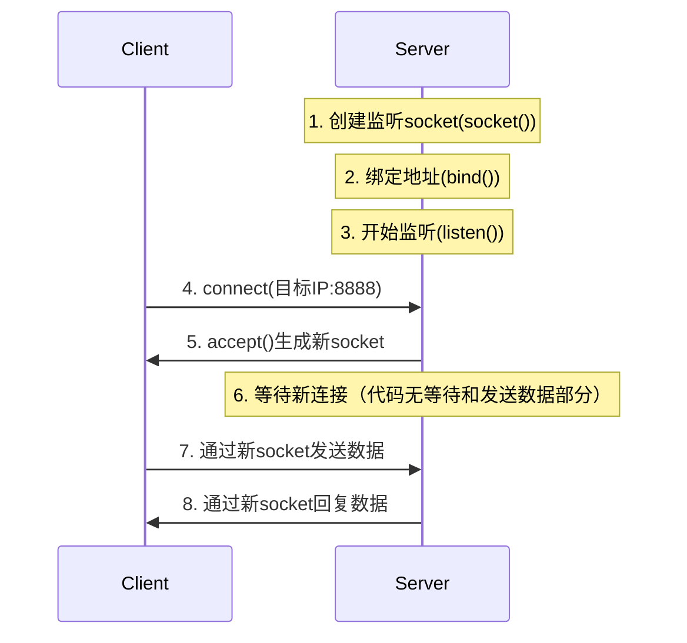

# day01-从一个最简单的socket开始

## 开始

如果读者之前有计算机网络的基础知识那就更好了，没有也没关系，socket编程非常容易上手。但本教程主要偏向实践，不会详细讲述计算机网络协议、网络编程原理等。想快速入门可以看以下博客，讲解比较清楚、错误较少：

- [计算机网络基础知识总结](https://www.runoob.com/w3cnote/summary-of-network.html)

要想打好基础，抄近道是不可的，有时间一定要认真学一遍谢希仁的《计算机网络》，要想精通服务器开发，这必不可少。

首先在服务器，我们需要建立一个socket套接字，对外提供一个网络通信接口，在Linux系统中这个套接字竟然仅仅是一个文件描述符，也就是一个`int`类型的值！这个对套接字的所有操作（包括创建）都是最底层的系统调用。
> 在这里读者务必先了解什么是Linux系统调用和文件描述符，《现代操作系统》第四版第一章有详细的讨论。如果你想抄近道看博客，C语言中文网的这篇文章讲了一部分：[socket是什么？套接字是什么？](http://c.biancheng.net/view/2123.html)

> Unix哲学KISS：keep it simple, stupid。在Linux系统里，一切看上去十分复杂的逻辑功能，都用简单到不可思议的方式实现，甚至有些时候看上去很愚蠢。但仔细推敲，人们将会赞叹Linux的精巧设计，或许这就是大智若愚。


```cpp
#include<windows.h>
int sockfd = socket(AF_INET, SOCK_STREAM, 0);
```
- 第一个参数：IP地址类型，AF_INET表示使用IPv4，如果使用IPv6请使用AF_INET6。
- 第二个参数：数据传输方式，SOCK_STREAM表示流格式、面向连接，多用于TCP。SOCK_DGRAM表示数据报格式、无连接，多用于UDP。
- 第三个参数：协议，0表示根据前面的两个参数自动推导协议类型。设置为IPPROTO_TCP和IPPTOTO_UDP，分别表示TCP和UDP。

对于客户端，服务器存在的唯一标识是一个IP地址和端口，这时候我们需要将这个套接字绑定到一个IP地址和端口上。首先创建一个sockaddr_in结构体
```cpp
#include<winsock2.h>  //这个头文件包含了<netinet/in.h>，不用再次包含了
struct sockaddr_in serv_addr;
memset(&serv_addr, 0, sizeof(serv_addr));
```
然后使用`bzero`初始化这个结构体，这个函数在头文件`<string.h>`或`<cstring>`中。这里用到了两条《Effective C++》的准则：
> 条款04: 确定对象被使用前已先被初始化。如果不清空，使用gdb调试器查看addr内的变量，会是一些随机值，未来可能会导致意想不到的问题。
>
> 这一条被应用于serv_addr的初始化上，使用`memset`的原因是，`sockaddr_in`结构体可能包含多个字段，其中一些字段在当前上下文中不使用。将这些未使用的字段初始化为0可以防止它们**包含垃圾值**，这些垃圾值可能会引起不可预测的行为。特别是在网络编程中，任何微小的错误都可能导致连接失败或数据传输错误。

> 条款01: 视C++为一个语言联邦。把C和C++看作两种语言，写代码时需要清楚地知道自己在写C还是C++。如果在写C，请包含头文件`<string.h>`。如果在写C++，请包含`<cstring>`。

设置地址族、IP地址和端口：
```cpp
serv_addr.sin_family = AF_INET;
serv_addr.sin_addr.s_addr = inet_addr("127.0.0.1");
serv_addr.sin_port = htons(8888);
```
然后将socket地址与文件描述符绑定：
```cpp
bind(sockfd, (sockaddr*)&serv_addr, sizeof(serv_addr));
```
> 为什么定义的时候使用专用socket地址（sockaddr_in）而绑定的时候要转化为通用socket地址（sockaddr），以及转化IP地址和端口号为网络字节序的`inet_addr`和`htons`等函数及其必要性，在游双《Linux高性能服务器编程》第五章第一节：socket地址API中有详细讨论。
>
> ***ai解释：***`sockaddr_in`**仅支持IPv4**，它无法处理IPv6连接！如果你的服务器使用`AF_INET`创建socket，**只能接受IPv4客户端连接**。若要支持IPv6，必须：
>
> 1. 使用`AF_INET6`创建socket
> 2. 使用`sockaddr_in6`结构体
> 3. 设置`sin6_family = AF_INET6`
>
> 类型转换的根本原因是**Socket API的设计哲学**：
>
> - `sockaddr`是**通用地址结构基类**
> - `sockaddr_in`(IPv4)和`sockaddr_in6`(IPv6)是**具体实现子类**
> - 这种设计实现**协议无关编程**（类似面向对象的多态）
>
> 而使用htons的原因是：**CPU架构差异导致字节序不同**
>
> - 小端序(LE)
>
>     ：Windows x86/x64使用（低位字节在前）
>
>     - 端口8888（十六进制0x22B8）在内存中为：`B8 22 00 00`
>
> - 网络字节序
>
>     ：TCP/IP协议强制使用
>
>     大端序(BE)
>
>     （高位字节在前）
>
>     - 传输时要求格式为：`00 00 22 B8`
>
> 如果不进行转换为标准格式，就可能会将server端在通过bind函数读取serv_addr中配置时，实际绑定到其他窗口，比如8888反向读取会得到47138

同理，这种设计也表现在传入serv_addr或者clint_addr连接参数ip地址时，需要使用`inet_addr()`来设置，用`inet_ntoa()`读取。由于sockaddr_in的定义为：

```cpp
struct sockaddr_in {
	short	sin_family;
	u_short	sin_port;
	struct in_addr	sin_addr;
	char	sin_zero[8];
};
// in_addr定义为
typedef struct in_addr {
  union {
    struct { u_char  s_b1, s_b2, s_b3, s_b4; } S_un_b;
    struct { u_short s_w1, s_w2; } S_un_w;
    u_long S_addr;
  } S_un;
} IN_ADDR, *PIN_ADDR, *LPIN_ADDR;
```

`sin_addr`是一个`unsigned long`变量，所以直接赋值可能会导致数据格式冲突

| 表示方式       | 内存存储      | 示例         | 需要转换？     |
| :------------- | :------------ | :----------- | :------------- |
| 人类可读字符串 | "192.168.1.1" | 文本数据     | ✅ 需要转换     |
| 内核二进制表示 | 0xC0A80101    | 单字节整数   | ❌ 不可直接使用 |
| 网络传输格式   | 大端序        | 固定字节顺序 | ✅ 需要统一     |

使用`inet_addr`会将人类可读字符串转化为内置二进制**的网络传输格式（32位）**表示，保证在**不同CPU架构上的处理**不会出错
```cpp
serv_addr.sin_addr.s_addr = 0xC0A80101; // 直接赋值192.168.1.1二进制
// 在小端机器上会被存储为 01 01 A8 C0
// 网络传输时按大端解析 → 实际IP变成1.1.168.192（完全错误！）
// 同理，读取时也需要适当转换将网络序转主机序并格式化输出为人类可读方式，至于ntons和ntohs，则是将16位的网络序和主机序相互转化
```

| 函数            | 输入                   | 输出                   | 真正作用                                                     | 常见错误认知                                |
| --------------- | ---------------------- | ---------------------- | ------------------------------------------------------------ | ------------------------------------------- |
| **`inet_addr`** | "192.168.1.1" (字符串) | 0xC0A80101 (32位整数)  | **将点分十进制字符串 → **网络字节序**二进制整数**<br>（*不涉及主机序转换*） | "先转主机序再转网络序" ❌                    |
| **`inet_ntoa`** | 0xC0A80101 (32位整数)  | "192.168.1.1" (字符串) | **将**网络字节序**二进制整数 → 点分十进制字符串**<br>（*不涉及主机序转换*） | "先转主机序再格式化" ❌                      |
| **`htons`**     | 8888 (主机字节序)      | 0x22B8 (网络字节序)    | **主机字节序 → 网络字节序** (16位)                           | "只用于端口"（实际所有16位协议字段都需要）✅ |
| **`ntohs`**     | 0x22B8 (网络字节序)    | 8888 (主机字节序)      | **网络字节序 → 主机字节序** (16位)                           | "只用于端口显示"（实际所有16位字段都需要）✅ |

最后我们需要使用`listen`函数监听这个socket端口，这个函数的第二个参数是listen函数的最大监听队列长度，系统建议的最大值`SOMAXCONN`被定义为128。

```cpp
listen(sockfd, SOMAXCONN);
```
要接受一个客户端连接，需要使用`accept`函数。对于每一个客户端，我们在接受连接时也需要保存客户端的socket地址信息，于是有以下代码：
```cpp
struct sockaddr_in clnt_addr;
socklen_t clnt_addr_len = sizeof(clnt_addr);
memset(&clnt_addr, 0, sizeof(clnt_addr));
int clnt_sockfd = accept(sockfd, (sockaddr*)&clnt_addr, &clnt_addr_len);
printf("new client fd %d! IP: %s Port: %d\n", clnt_sockfd, inet_ntoa(clnt_addr.sin_addr), ntohs(clnt_addr.sin_port));
```
要注意和`accept`和`bind`的第三个参数有一点区别，对于`bind`只需要传入serv_addr的大小即可，而`accept`需要写入客户端socket长度，所以需要定义一个类型为`socklen_t`的变量，并传入这个变量的地址。另外，`accept`函数会阻塞当前程序，直到有一个客户端socket被接受后程序才会往下运行。

到现在，客户端已经可以通过IP地址和端口号连接到这个socket端口了，让我们写一个测试客户端连接试试：
```cpp
int sockfd = socket(AF_INET, SOCK_STREAM, 0);
struct sockaddr_in serv_addr;
memset(&serv_addr, 0, sizeof(serv_addr));
serv_addr.sin_family = AF_INET;
serv_addr.sin_addr.s_addr = inet_addr("127.0.0.1");
serv_addr.sin_port = htons(8888);
connect(sockfd, (sockaddr*)&serv_addr, sizeof(serv_addr));  
```
代码和服务器代码几乎一样：创建一个socket文件描述符，与一个IP地址和端口绑定，最后并不是监听这个端口，而是使用`connect`函数尝试连接这个服务器。

服务端监听和客户端连接：想象一家公司：

- `sockfd`（监听socket）= 公司总机（固定号码：8888）
    - 作用：**只接听来电**，不处理具体业务
    - 特性：一个总机可转接多个分机
- `clnt_sockfd`（连接socket）= 业务分机（动态分配）
    - 作用：**专门处理单个客户业务**
    - 特性：每个客户独占一个分机

Socket是**双向通信通道的端点**

- TCP连接需要**两个端点**才能建立全双工通信
- 就像打电话：**双方都需要电话机**（一端发送，一端接收）
- 每个socket封装了：IP地址 + 端口号 + 协议状态

| 函数       | 作用                               | 类比         | 是否传输数据 |
| ---------- | ---------------------------------- | ------------ | ------------ |
| `socket()` | 申请**通信资源**（创建端点）       | 申请电话线路 | ❌            |
| `accept()` | **接受已建立的连接**，生成专用通道 | 总机转接分机 | ✅            |

对于bind函数只在server端出现，并且只绑定server端的socket关键字：

1. **地址绑定**：将socket与**特定IP:端口**关联（如：将总机号码设为8888）
2. **服务标识**：让客户端知道"该连接到哪里"
3. **内核注册**：通知操作系统"这个端口有服务在监听"

至此，day01的教程已经结束了，进入`code/day01`文件夹，使用make命令编译，将会得到`server`和`client`。输入命令`./server`开始运行，直到`accept`函数，程序阻塞、等待客户端连接。然后在一个新终端输入命令`./client`运行客户端，可以看到服务器接收到了客户端的连接请求，并成功连接。

```
new client fd 3! IP: 127.0.0.1 Port: 53505
```
但如果我们先运行客户端、后运行服务器，在客户端一侧无任何区别，却并没有连接服务器成功，因为我们day01的程序没有任何的错误处理。

事实上对于如`socket`,`bind`,`listen`,`accept`,`connect`等函数，通过返回值以及`errno`可以确定程序运行的状态、是否发生错误。在day02的教程中，我们会进一步完善整个服务器，处理所有可能的错误，并实现一个echo服务器（客户端发送给服务器一个字符串，服务器收到后返回相同的内容）。

`accept()`函数不会限制客户端连接，而是：

1. 从已建立的连接队列中取出一个连接
2. 返回一个新的socket文件描述符用于与客户端通信
3. 自动填充 `clnt_addr`，记录客户端的地址信息

`SOCKET clnt_sockfd = accept(sockfd, (sockaddr*)&clnt_addr, &clnt_addr_len);`代码作用是从根据sockfd的设置，返回一个用于***描述和客户端连接关系**的套接字，并将客户端的连接配置写入`clnt_addr`中。

- 一旦 `bind()` 完成，服务器就开始监听指定的IP:端口
- 所有连接请求只要目标地址匹配，都会被放入**连接队列**
- `accept()` 只是把队列中最前面的连接取出来，生成新socket文件描述符

整个程序的运行流程图为：


- `bind()` = 指定快递柜的地址和取件码（服务器配置）
- `listen()` = 开启取件码扫描模式 (等待连接)
- `accept()` = 客户扫码取件，系统分配一个新快递柜格子 (创建新socket)
- `clnt_addr` = 记录客户的手机号（输出参数） (客户端信息)

完整源代码：[https://github.com/yuesong-feng/30dayMakeCppServer/tree/main/code/day01](https://github.com/yuesong-feng/30dayMakeCppServer/tree/main/code/day01)

## windows环境代码

windows环境中，如果要使用socket需要使用`#include<winsock.h>`或者`winsock2.h`，使用`#include<winsock2.h>`则需要改成`#include<windows.h>`并且加上`#pragma comment(lib, "ws2_32.lib")`连接对应的库才能使用socket api，bzero替换为memset

再使用socket之前，必须加一段这样的代码来初始化window socket，代码结尾加上`WSACleanup()`清理占用资源，如果更规范一点，使用closesocket函数来关闭使用类似`SOCKET clnt_sockfd = **accept**(sockfd, (sockaddr*)&clnt_addr, &clnt_addr_len);`创建的socket链接
```cpp
WSADATA wsaData;
if (WSAStartup(MAKEWORD(2, 2), &wsaData) != 0) {
    printf("WSAStartup failed\n");
    return 1;
}

WSACleanup();		// 结尾
```

完整代码：

```cpp
// server.cpp
#include <stdio.h>
#include <winsock2.h>
#include <windows.h>
#include <string.h>
#pragma comment(lib, "ws2_32.lib")

int main() {
    // 初始化Windows Socket
    WSADATA wsaData;
    if (WSAStartup(MAKEWORD(2, 2), &wsaData) != 0) {
        printf("WSAStartup failed\n");
        return 1;
    }

    // 创建socket
    SOCKET sockfd = socket(AF_INET, SOCK_STREAM, 0);
    if (sockfd == INVALID_SOCKET) {
        printf("socket failed: %d\n", WSAGetLastError());
        WSACleanup();
        return 1;
    }

    // 设置服务器地址
    struct sockaddr_in serv_addr;
    memset(&serv_addr, 0, sizeof(serv_addr));
    serv_addr.sin_family = AF_INET;
    serv_addr.sin_addr.s_addr = inet_addr("127.0.0.1");
    serv_addr.sin_port = htons(8888);

    // 绑定socket
    if (bind(sockfd, (sockaddr*)&serv_addr, sizeof(serv_addr)) == SOCKET_ERROR) {
        printf("bind failed: %d\n", WSAGetLastError());
        closesocket(sockfd);
        WSACleanup();
        return 1;
    }

    // 监听连接
    if (listen(sockfd, SOMAXCONN) == SOCKET_ERROR) {
        printf("listen failed: %d\n", WSAGetLastError());
        closesocket(sockfd);
        WSACleanup();
        return 1;
    }

    printf("Server listening on 127.0.0.1:8888...\n");

    // 接受客户端连接
    struct sockaddr_in clnt_addr;
    int clnt_addr_len = sizeof(clnt_addr);
    memset(&clnt_addr, 0, sizeof(clnt_addr));

    SOCKET clnt_sockfd = accept(sockfd, (sockaddr*)&clnt_addr, &clnt_addr_len);
    if (clnt_sockfd == INVALID_SOCKET) {
        printf("accept failed: %d\n", WSAGetLastError());
        closesocket(sockfd);
        WSACleanup();
        return 1;
    }

    printf("New client connected! Socket: %lld, IP: %s, Port: %d\n", 
           clnt_sockfd, inet_ntoa(clnt_addr.sin_addr), ntohs(clnt_addr.sin_port));

    // 关闭连接
    closesocket(clnt_sockfd);
    closesocket(sockfd);
    WSACleanup();
    
    return 0;
}

// ---------------------------------------------------
// client.cpp
#include <stdio.h>
#include <winsock2.h>
#include <windows.h>
#include <string.h>
#pragma comment(lib, "ws2_32.lib")

int main() {
    // 初始化Windows Socket
    WSADATA wsaData;
    if (WSAStartup(MAKEWORD(2, 2), &wsaData) != 0) {
        printf("WSAStartup failed\n");
        return 1;
    }

    // 创建socket
    SOCKET sockfd = socket(AF_INET, SOCK_STREAM, 0);
    if (sockfd == INVALID_SOCKET) {
        printf("socket failed: %d\n", WSAGetLastError());
        WSACleanup();
        return 1;
    }

    // 设置服务器地址
    struct sockaddr_in serv_addr;
    memset(&serv_addr, 0, sizeof(serv_addr));
    serv_addr.sin_family = AF_INET;
    serv_addr.sin_addr.s_addr = inet_addr("127.0.0.1");
    serv_addr.sin_port = htons(8888);

    printf("Connecting to server...\n");

    // 连接服务器
    if (connect(sockfd, (sockaddr*)&serv_addr, sizeof(serv_addr)) == SOCKET_ERROR) {
        printf("connect failed: %d\n", WSAGetLastError());
        closesocket(sockfd);
        WSACleanup();
        return 1;
    }

    printf("Connected to server successfully!\n");

    // 关闭连接
    closesocket(sockfd);
    WSACleanup();
    
    return 0;
}
```

运行结果：先运行server.exe，程序在运行期间会：

1. 根据serv_addr的配置，将连接配置绑定到服务端的套接字sockfd来管理，通过lisen函数监听127.0.0.1:8888，也就是监听本机电脑的8888端口，